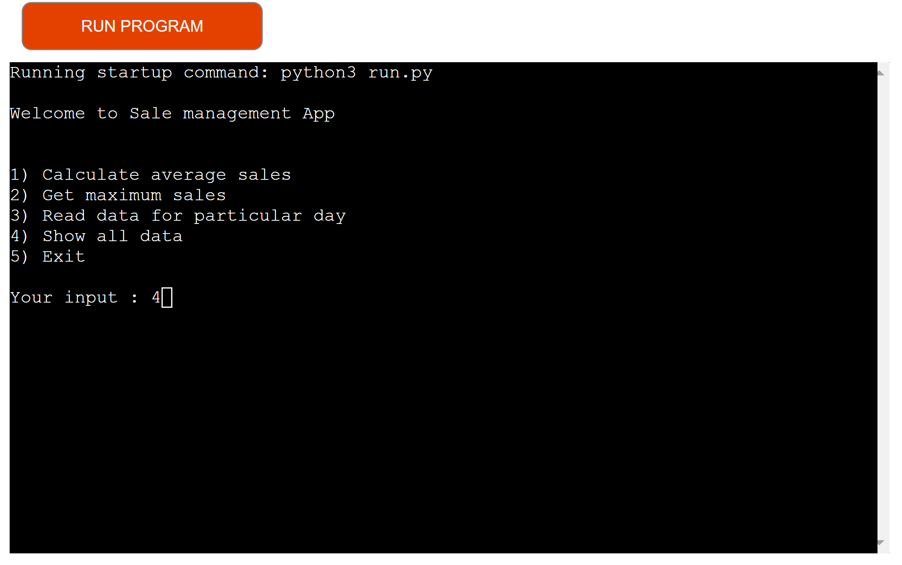

# Nikhils Sales App for Wrestling T-Shirts 

My Application was completed in Github, which runs runs in Heroku.

Please access the [live application](https://project-wrestling.herokuapp.com/) via this link.

The application will tell you

1) The average Sales for all t-shirt companies sold during the week of 11-10-2021 - 18-10-2021
2) Maxmium sales for one company and the date
3) Read sales data for t-shirts sold on a particular day
4) The number of tshirts sold by each company during the period 11-10-2021 - 18-10-2021

Here is the final version

 
1. ## Objectives

### External user’s goal:

The application user wants to glean insights from survey results.

### Site owner's goal: 
The application should provide actionable insights from an inputted dataset.

### Potential features to include:

Import survey results from the terminal, structured data file or similar.
Parse and analyse the data
Export the results to an appropriate file

## How to use

I designed a flow diagram which shows my thought process on how I wanted to design my application. 

My Application is a simple sales data app. Instructions to use every function are below

1) Click runprogram 

2) Decide which option to use and click it 
3) Follow instructions
4) To Calculate average sales
5) Click Calculate average sales option
6) Press 1

7) Average Sales of all companies over dates between 11-10-2021 - 18-10-2021 shows up

8) Click run program to return to menu

9) To Get maximum sales
10) Enter 2
11) It will show - maximum total sales for all companies by day took place

12) Click run program to return to menu 

13) To Read data for particular day
14) Enter 3
15) Enter Date in correct order DD-MM-YYYY

16) Data for particular day shows

17) Click run program to return to menu

18) Enter 4

19) All data for all shirts sold displays

20) To quit press run program to return to main menu
<<<<<<< HEAD

=======

>>>>>>> dea9bcf2a4f82e190f58fe797bd3913360132ce1

2. ## Features

### Initial Deployment Features

## Main Menu

The Main Menu prints a simple welcome message and then prompts a User to select one of the five options: calculate average sales, maximum sales, read data for particular day, all data and exit.

If a user tries to select a number not on the menu, or tries to enter a word for option 3, the user is prompted to enter a correct value.

The other options are below and show how it can be done.

## Calculate average sales

## Get maximum sales

## Read data for particular day

## Show all data

3. ## Deployment

This project was deployed using  Heroku terminal as follows:

1. Create the Gitpod repo via the Github template.

2. Log into Heroku and create a new app.

3. Set Heroku build packs to Python and NodeJS (in that order)

4. Link Github and Heroku accounts

5. Select the main repository and link to the Heroku app

6. Click on deploy.

Please access the [live application](https://project-wrestling.herokuapp.com/) via this link.
<<<<<<< HEAD

4. ## Testing

Code was first tested using the PEP8 Online validator. I had issues which were amended and I currently have no issues found in the code as detailed in the screenshot below:

=======

4. ## Testing

Code was first tested using the PEP8 Online validator. I had issues which were amended and I currently have no issues found in the code as detailed in the screenshot below:

>>>>>>> dea9bcf2a4f82e190f58fe797bd3913360132ce1

I also tested my application for errors when you put in either a word or wrong number - the results are below.

 

5. ## Technologies Used

[Pep8 Online](http://pep8online.com/) was used to validate the code.

[Heroku](https://www.heroku.com) was used to deploy the application.

[Github](https://github.com/nikhilkalhan92) was used as the repository hosting service.

[Gitpod](https://www.gitpod.io/) was used as the Code Editor for the site.

[Lucid](https://www.lucidchart.com/pages/) - used to do my flowchat

6. ## Final Project

<<<<<<< HEAD

7. ## Credits

Many Thanks to my mentor Marcel, and Emmanual 'Mani' Silva for help/guidance and inspiration during this journey.
=======

7. ## Credits
>>>>>>> dea9bcf2a4f82e190f58fe797bd3913360132ce1

Many Thanks to my mentor Marcel, and Emmanual 'Mani' Silva for help/guidance and inspiration during this journey.

