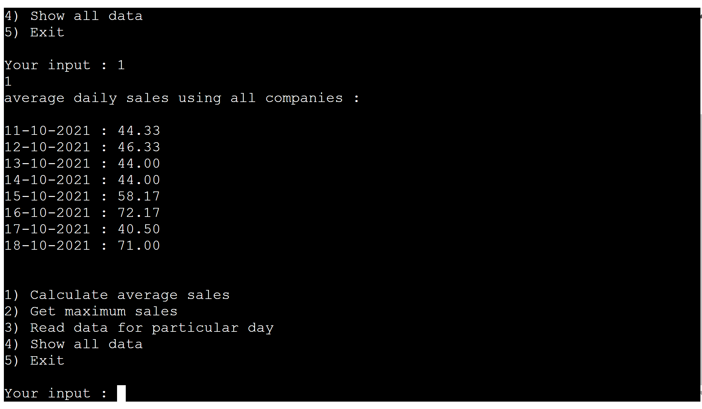

# Nikhils Sales App for Wrestling T-Shirts 

My Application was completed in Github, which runs runs in Heroku.

Users can look into sales data - such as most sold on any day, the average , what days were the shirts most sold on and entering new sales data for specific t-shirts

Final outcome is below

## How to use

To use my application, it gives you 6 options: they are Calculate Average sales, maximum sales, data for a particular day, add sales data, search a specifc t-shirt and exit the program.

I designed a simple diagram below which shows my thought process on how I wanted to deisgn my application. 

I wanted to give the user simple rules to either search for data or use the app by entering the dat themselves.

For example if you want to know what day the maximum sales were, you would type '2' and the information would come up.

The main part is putting new sales data: Now you type '4', the date of when the sales were made. You then put the numbers in for the t-shirts sold on the specific day and it will update.

## Features

### Initial Deployment Features

#### Main Menu

The Main Menu prints a simple welcome message and then prompts a User to select one of the six options, calculate average sales, maximum sales, read data for particular day , add data , search tshirt and exit

If a user tries to select a number not on the menu, or tries to enter a word, the user is prompted to enter a correct value.

Upon selecting an option, lets just say 4) Add Data, user is asked to enter a date, once listed an correct data, the user is then asked to put in the sold data for 'Kenny Omega' , please enter a figure, and follow the same process for the other 5 tshirts solds. Once inputed the sales data will update and the figures are in the correct format.

The other options are below and show how it can be done.

CALCULATE AVERAGE SALES

GET MAXIMUM SALES

READ DATA FOR PARTCULAR DAY

SEARCH T SHIRT

## Deployment

This project was deployed using  Heroku terminal as follows:

1. Create the Gitpod repo via the Github template.

2. Log into Heroku and create a new app.

3. Set Heroku build packs to Python and NodeJS (in that order)

4. Link Github and Heroku accounts

5. Select the main repository and link to the Heroku app

6. Click on deploy.

## Testing

Code was first tested using the PEP8 Online validator. No issues were found in the code as detailed in the screenshot below:

## Technologies Used

[Pep8 Online](http://pep8online.com/) was used to validate the code.

[Heroku](https://www.heroku.com) was used to deploy the application.

[Github](https://github.com/nikhilkalhan92) was used as the repository hosting service.

[Gitpod](https://www.gitpod.io/) was used as the Code Editor for the site.

[Balsamic](https://balsamiq.com/) was used to do the wireframes

## Final Project

